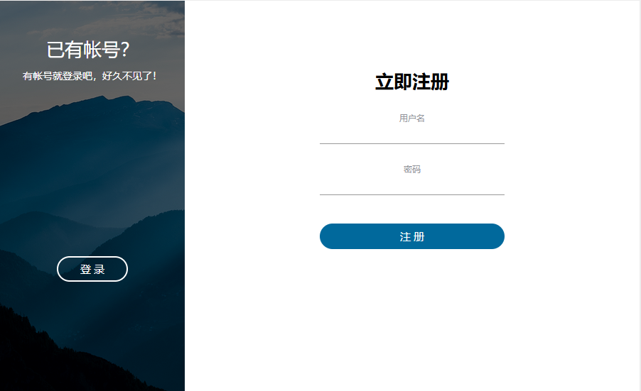
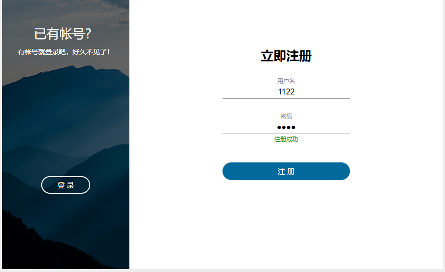
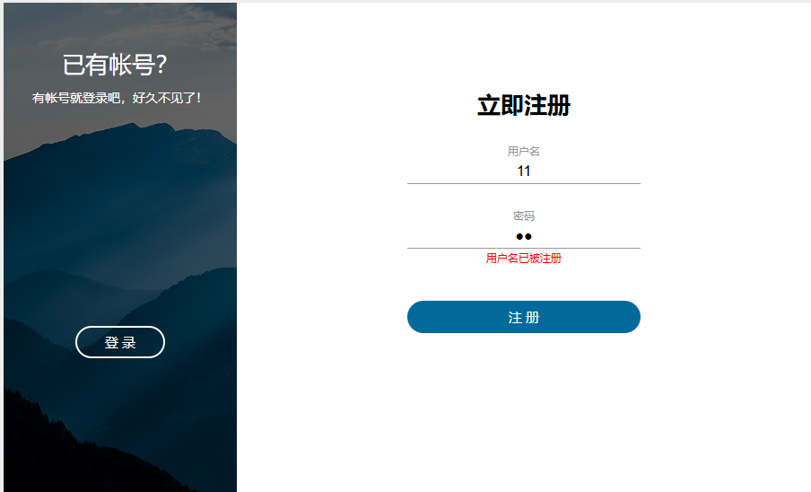
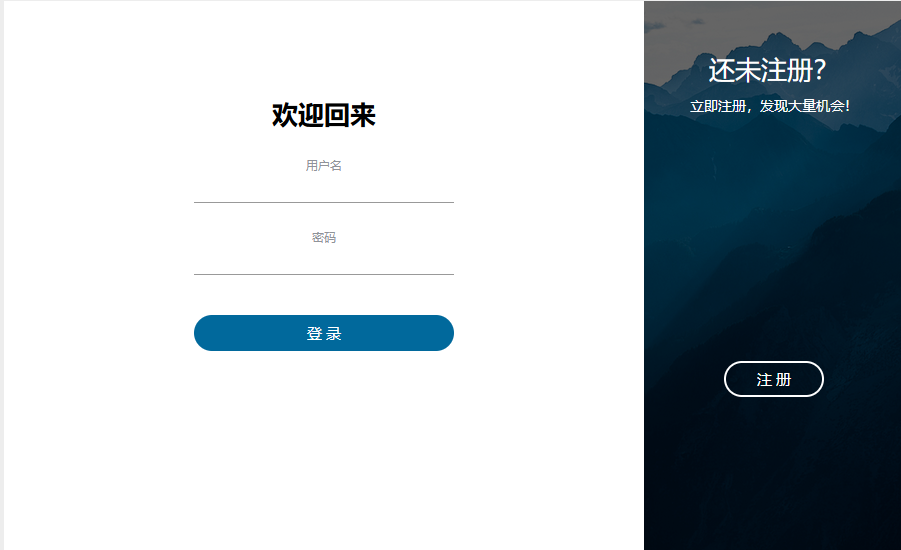
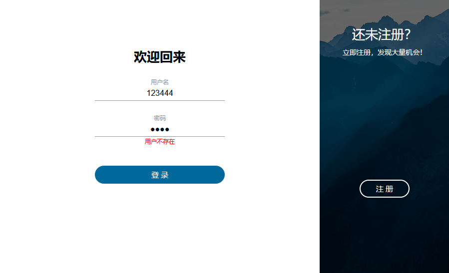
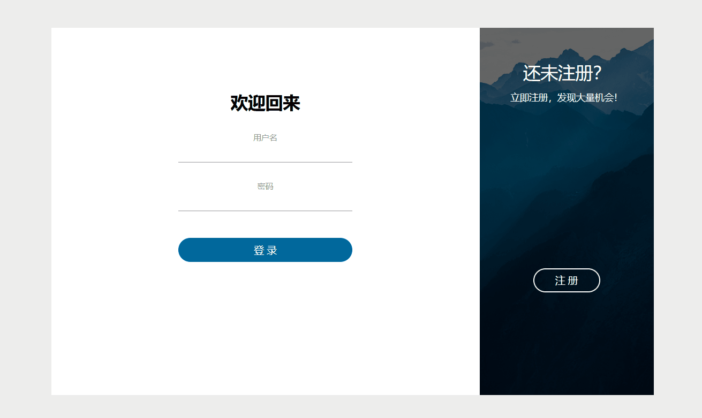
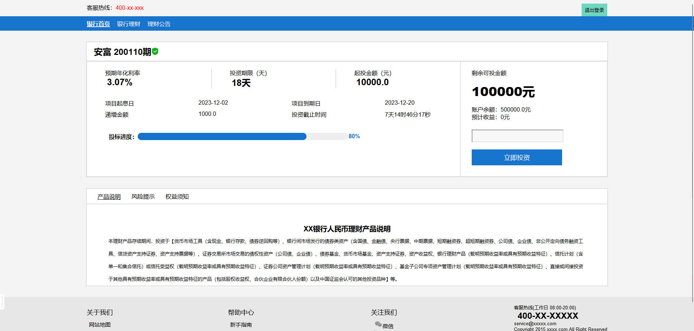
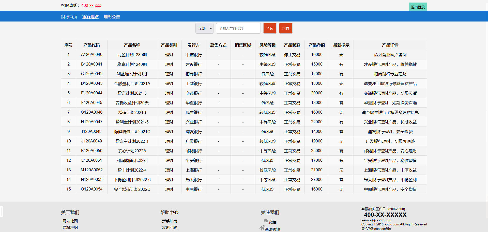
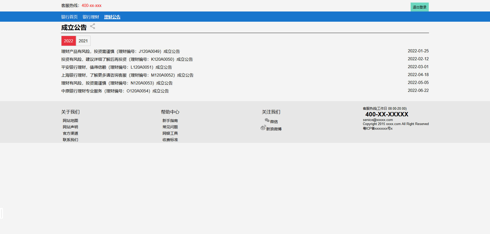

**银行理财设计文档**
---
该项目是一个简单的理财平台，提供用户注册、登录、首页展示、银行理财产品查询等功能。项目采用JS、Vue框架作为动态页面技术，Servlet处理后端逻辑，JDBC用于与MySQL数据库交互。

<br><br><br>

## 1. 登录系统
---
登录系统包含两个主要页面：**注册页面** *(Register)* 和 **登录页面** *(Login)*。这两个页面均设计有相应的提交表单，用户可以通过这些表单输入必要的信息以完成操作。

> 在注册页面，用户需要填写注册页面上的表单，包括用户名和密码，并将这些信息提交至数据库`database`。<br>
> 在登录页面，用户则需要输入之前注册时所创建的用户名和密码，通过提交表单将这些信息提交至数据库进行验证，从而成功登录系统。

> 在注册中会对数据库的数据进行检索，如果发现有重复的用户名，将会提示：<span style="color: red;"><strong>用户名已被注册</strong></span><br>
> 在登录中同样会对数据库的数据进行检索，如果没有注册该用户名，将会提示：<span style="color: red;"><strong>用户不存在</strong></span>

这一双重页面结构旨在提供灵活而安全的用户身份验证机制，以确保系统的可靠性和用户数据的安全性。

<br>

### 1.1 功能实现

#### 1.1.1 前端实现
##### 1. 注册页面`Register`和登录页面`Login` 

注册页面`Register` 这一部分包含了一个图像和一个注册表单。图像中的两个`div`元素包含了一些文本和一个按钮。按钮的不同位置对应不同的注册或登录操作。注册表单包括两个输入字段（用户名和密码）和两个相关的帮助文本。还有一个提交按钮，点击时会触发`registerAction`函数。

登录页面`Login` 这一部分定义了一个登录表单，其中包含一个标题、两个输入框（**用户名和密码**）以及一个登录按钮。使用了CSS 类来定义样式，以及v-bind指令来绑定变量 `{{redText}}` 和 `{{greenText}}` 到元素的属性上。点击登录按钮时，会调用`loginAction`函数。

##### 2. Vue部分功能实现 
```js
<script src="js/script.js"></script>  
<script src="js/vue.js"></script>  
<script>  
    var app = new Vue({  
        el: "#app",  
        data: {  
            greenText: "",  
            redText: "",  
        },  
        methods: {  
            loginAction: function () {  
                this.redText = "";  
                this.greenText = "";  
                let self = this;  
                let xhr = new XMLHttpRequest();  
                xhr.open('POST', '/bighome/lg', true);  
                xhr.setRequestHeader('Content-type', 'application/json');  
                // 等待服务器返回数据  
                xhr.onreadystatechange = function () {  
                    if (xhr.readyState === 4 && xhr.status === 200) {  
                        // console.log(xhr.responseText);  
                        let data = JSON.parse(xhr.responseText);  
                        if (data.status === "success") {  
                            alert("登录成功" + data.message)   
                            window.location.reload();  
                        } else {  
                            alert("登录失败" + data.message)  
                            this.redText = data.message;
							self.redText = data.message;  
                        }  
                    }  
                };  
                // 先发送数据  
                // 从input获取数据  
                let username = document.querySelector('[name="loginUsername"]').value;  
                let password = document.querySelector('[name="loginPassword"]').value;  
                xhr.send(JSON.stringify({username: username, password: password, type: "login"}));  
            },  
            buttonAction: function () {  
                this.redText = "";  
                this.greenText = "";  
                document.querySelector('.content').classList.toggle('s--signup')  
            },  
            registerAction: function () {  
                this.redText = "";  
                this.greenText = "";  
                let self = this;  
                let xhr = new XMLHttpRequest();  
                xhr.open('POST', '/bighome/lg', true);  
                xhr.setRequestHeader('Content-type', 'application/json');  
                // 等待服务器返回数据  
                xhr.onreadystatechange = function () {  
                    if (xhr.readyState === 4 && xhr.status === 200) {  
                        // console.log(xhr.responseText);  
                        let data = JSON.parse(xhr.responseText);  
                        if (data.status === "success") {  
                            alert("注册成功" + data.message)  
                            self.greenText = data.message;  
                        } else {  
                            alert("注册失败" + data.message)  
                            self.redText = data.message;  
                        }  
                    }  
                };  
                // 先发送数据  
                // 从input获取数据  
                let username = document.querySelector('[name="registerUsername"]').value;  
                let password = document.querySelector('[name="registerPassword"]').value;  
                xhr.send(JSON.stringify({username: username, password: password, type: "register"}));  
            }  
        }  
    })  
</script>
```
>  此部分为Vue应用程序，通过引入Vue.js和自定义的script.js文件来实现。代码中创建了一个Vue实例，设置了两个数据属性（`greenText`和`redText`），以及三个方法（`loginAction`，`buttonAction`和`registerAction`）。
>  
>  	1. `loginAction`方法用于处理用户登录逻辑；
>  	2. `buttonAction`方法用于处理按钮点击事件；
>  	3. `registerAction`方法用于处理用户注册逻辑。
> 
>  在方法中，通过`XMLHttpRequest`对象向服务器发送请求，并根据服务器返回的数据更新页面上的文本内容。
<br>

#### 1.1.2 后端实现
##### 1. 数据库实现
###### **数据库设计**
表名:  `servlet_save`

|列名|数据类型|约束|说明|
|---|---|---|---|
|`usrname`|`VARCHAR(100)`|`NOT NULL`, Primary Key|用户名，最大长度100，不允许为空，作为主键|
|`usrpassword`|`VARCHAR(100)`|`NOT NULL`|用户密码，最大长度100，不允许为空|

---
###### 数据库代码实现
```java
public static void checkTable(Connection connection) {  
    try {  
        Statement statement = connection.createStatement();  
    String sql = "CREATE TABLE if not exists `servlet_save` (\n" +  
            "  `usrname` varchar(100) CHARACTER SET utf8mb4 COLLATE utf8mb4_0900_ai_ci NOT NULL,\n" +  
            "  `usrpassword` varchar(100) CHARACTER SET utf8mb4 COLLATE utf8mb4_0900_ai_ci NOT NULL,\n" + 
            "  PRIMARY KEY (`usrname`)\n" +  
            ") ENGINE=InnoDB DEFAULT CHARSET=utf8mb4 COLLATE=utf8mb4_0900_ai_ci;";  
        statement.execute(sql);  
    } catch (SQLException e) {  
        e.printStackTrace();  
        System.out.println("checkTable error");  
    }  
}
```
> 这个函数使用传入的连接对象来创建一个名为`servlet_save`的表，该表包含`usrname`和`usrpassword`两个列，其中`usrname`列为主键。如果表不存在则创建，如果已存在则不执行任何操作。函数通过执行SQL语句来实现此功能。如果执行过程中出现异常，则打印异常信息并输出`checkTable error`。

<br>

### 1.2 页面展示

#### 1.2.1 注册页面

1. 初始页面



---
2. 注册成功


---
3. 注册失败



>  提示：**用户名已被注册**
---

#### 1.2.2 登录页面

1. 初始页面


---
2. 登录失败


>   提示：**用户不存在**


#### 1.2.3 特色功能

左右过度切换的登录注册页面



<br><br><br>

## 2. 主页
---
在银行理财设计中，主页共包含三大模块：**理财首页、银行理财、理财公告**

<br>

### 2.1 理财首页 `index`

包括首页设计、数据动态响应和数据库设计三方面

#### 2.1.1 首页设计

1. **顶部标签导航**：
    - 显示在页面顶部，包括银行客服热线和退出登录按钮。
    - 通过导航栏提供快捷方式，使用户能轻松访问其他页面。
    - 以水平标签的形式展示在页面上部，包括"银行首页"、"银行理财"和"理财公告"等标签。
    - 通过点击这些标签，**用户可以快速切换到对应的页面，实现快速导航。**
2. **产品展示区域**：
    - 包含产品的基本信息，如**产品名称、预期年化利率、投资期限、起投金额**等。
    - 利用Vue.js实现数据的动态绑定，使这些信息能够**实时更新**。
    - 展示了产品的起息日和到期日，以及递增金额和投资截止时间。
3. **投资进度条**：
    - 使用进度条展示当前产品的投资进度，即已投金额占总投资额的百分比。
    - 利用Vue.js的数据绑定，实现**动态更新进度条**的效果。
4. **用户投资交互区域**：
    - 提供了输入框，让用户输入投资金额。
    - 使用Vue.js实现输入金额的实时响应和相关计算。
    - 展示了用户账户余额和预计收益，并根据用户输入的金额计算预计收益。
5. **标签页切换区域**：
    - 包含了产品说明、风险提示、权益须知等标签页。
    - 通过点击标签，展示不同的标签内容。
    - 利用Vue.js实现标签的切换和内容的动态更新。
6. **底部信息区域**：
    - 包括关于我们、帮助中心、关注我们等相关链接。
    - 显示客服热线，并提供联系方式。
    - 提供网站地图、网站声明等信息。
7. **响应式设计**：
    - **采用了响应式布局，使页面能够适应不同的设备和屏幕尺寸。**
    - 通过媒体查询等技术，确保在移动设备上也能提供良好的用户体验。

#### 2.1.2 数据动态响应

该页面是一个使用Vue.js实现的动态页面，通过AJAX请求与后端交互获取数据，展示银行理财产品的详细信息，同时提供用户投资和退出登录的功能。

- **data 属性**
    - 包含页面中需要动态展示的各种数据，如产品名称、年化利率、投资期限等。
    - 用于计算和展示投资进度、剩余可投金额、账户余额、预计收益等信息。
- **methods 方法**
    - `allMethodRun`: 初始化页面，调用获取数据的方法。
    - `selectTab`: 切换标签页的方法。
    - `startProgress`: 启动投资进度条动画的方法。
    - `getShowData`: 通过AJAX请求获取后端数据的方法。
    - `startCountdown`: 启动倒计时的方法。
    - `padZero`: 格式化数字，补零的方法。
    - `InputMoney`: 处理用户输入投资金额并提交的方法。
    - `loginOut`: 处理用户退出登录的方法。

#### 2.1.3 数据库设计

表格：FinancialProducts
- 以下为示例：

|product_id|name|annual_interest_rate|start_date|end_date|incremental_amount|initial_amount|total_amount|remaining_amount|
|---|---|---|---|---|---|---|---|---|
|1|安富 200110期|3.07|2023-12-02|2023-12-20|1000.0|10000.0|500000.0|499008.0|

- `product_id` 是每个产品的唯一标识符，并设置为主键。
- `name` 表示理财产品的名称。
- `annual_interest_rate` 是理财产品的预期年化利率。
- `start_date` 和 `end_date` 表示项目的起息日和到期日。
- `incremental_amount` 是理财产品的递增金额。
- `initial_amount` 表示起始资金。
- `total_amount` 表示交易的资金总额。
- `remaining_amount` 表示账户余额。

#### 2.1.4 页面展示




<br>

### 2.2 银行理财 `financing`
这一部分内容主要是链接数据库，设计数据库并完成查询操作

#### 2.2.1 数据库设计
表格：FinancingData
- 以下为示例：

|id|code|name|category|issuer|raise_method|sales_area|risk_level|status|net_value|latest_tip|details|notice|time|
|---|---|---|---|---|---|---|---|---|---|---|---|---|---|
|1|B120A0041|稳赢计划1240期|理财|建设银行|-|-|中等风险|正常交易|15000|有|建设银行理财产品，收益稳健|建设银行理财推荐|2021-05-15|

- `id` 是每个条目的唯一标识符，并作为主键。
- `code` 是理财产品的代码。
- `name` 是理财产品的名称。
- `category` 表示产品的类别。
- `issuer` 是发行机构。
- `raise_method` 是募集方式。
- `sales_area` 表示销售区域。
- `risk_level` 表示风险等级。
- `status` 表示产品状态。
- `net_value` 表示净值。
- `latest_tip` 表示最新提示。
- `details` 是关于产品的详细信息。
- `notice` 是相关通知。
- `time` 是数据记录的时间戳。

#### 2.2.2 查询功能实现

##### 查询功能 (`search` 方法)

1. **Vue 数据绑定：** 在 HTML 中，通过 `v-model` 实现与 Vue 实例中 `selectedCategory` 和 `searchCode` 的双向数据绑定，分别表示选择的产品类别和输入的产品代码。
2. **查询按钮：** 当用户点击查询按钮时，触发 `search` 方法。
3. **查询逻辑：** 在 `search` 方法中，通过 `console.log` 输出用户选择的产品类别和输入的产品代码，并使用 `filter` 函数对 `tableData` 进行过滤，筛选符合条件的数据，将结果存储在 `filteredData` 中。
```js
methods: {  
    search: function () {  
        // 在这里添加查询逻辑  
        console.log('查询产品类别:', this.selectedCategory);  
        console.log('搜索产品代码:', this.searchCode);  
  
        // 过滤数据  
        this.filteredData = this.tableData.filter(item =>  
            (!this.selectedCategory || item.category === this.selectedCategory) &&  
            (!this.searchCode || item.code.includes(this.searchCode))  
        );  
    },
```

##### 重置功能 (`reset` 方法)

1. **重置按钮：** 当用户点击重置按钮时，触发 `reset` 方法。
2. **重置逻辑：** 在 `reset` 方法中，重置 `selectedCategory` 和 `searchCode`，同时恢复显示所有数据到 `filteredData`。此外，对 `tableData` 进行分类，将数据按照产品类别存储到 `categoryData` 中。
```js
reset: function () {  
    // 重置查询条件  
    this.selectedCategory = '';  
    this.searchCode = '';  
    // 恢复显示所有数据  
    this.filteredData = this.tableData;  
    // 对tableData进行分类，然后存储到categoryData中  
    this.categoryData = this.tableData.reduce((acc, cur) => {  
        if (!acc[cur.category]) {  
            acc[cur.category] = [];  
        }  
        acc[cur.category].push(cur);  
        return acc;  
    }, {});  
},
```
<br>

#### 2.2.3 页面展示



<br>

### 2.3 理财公告 `notice`
#### 2.3.1 页面设计

使用了Vue.js框架。页面上包括一个顶部导航栏、一个公告列表和一个底部导航栏。顶部导航栏包括客服热线、登录/注册和退出登录按钮。公告列表显示了不同年份的公告。底部导航栏包括一些链接和版权信息。页面通过Ajax请求从服务器获取公告数据，并使用Vue.js的数据绑定功能动态更新页面。用户点击年份按钮时，会请求并显示对应年份的公告。

#### 2.3.2 页面展示



---

<br><br><br>

## 3. 逻辑处理
---
主要介绍后端实现工具，实现方法等


### 3.1. `AllMysql.java`

主要功能是与MySQL数据库进行交互，包括创建表、插入数据、更新数据等操作。

1. **数据库表定义：**
    - 定义了四张表：`user`、`showdata`、`usershowdata`、`financingdata`。
    - 每张表都有特定的字段和约束，包括主键、数据类型等。
2. **数据初始化：**
    - 提供了一些初始数据的插入操作，例如`insertFinancingDataNewTabel`和`insertShowDataNewTabel`方法，用于在表创建时插入一些初始数据。
3. **数据操作方法：**
    - 提供了一系列方法用于执行数据库操作，包括插入用户数据、更新用户数据、获取用户数据等。
    - `updateUserTableOfMoney`方法用于更新用户表中的金额字段。
    - `checkTable`方法用于检查表是否存在，如果不存在则创建表，并插入一些初始数据。
4. **登录状态检查方法：**
    - 提供了`getLoginStatus`、`isCookieLogin`和`isSessionLogin`方法，用于检查用户的登录状态，从Cookie和Session中获取登录信息。
5. **获取数据方法：**
    - 提供了一些方法用于从数据库中获取数据，如`getShowData`方法用于获取展示数据，`getFinancingData`方法用于获取融资数据等。

<br>

### 3.2 `GetFinancingDataServlet.java`

这个函数是一个基于Servlet的Java程序，用于处理HTTP请求并返回相应的数据。它通过获取请求中的参数来确定返回的数据类型，并根据用户登录状态返回不同的结果。
```java
public void doGet(HttpServletRequest request, HttpServletResponse response) throws IOException { 
  
    String type = request.getParameter("type");  
    if (type == null) {  
        System.out.println("[argv] get financing data error, the type is null");  
        return;  
    }  
  
    JSONObject loginData = conn.getLoginStatus(request);  
  
    response.setContentType("application/json");  
    response.setCharacterEncoding("UTF-8");  
  
    if (loginData.getString("isLogin").equals("yes")) {  
        if (type.equals("financing")) {  
            response.getWriter().write(conn.getFinancingData().toString());  
        } else if (type.equals("year")) {  
            response.getWriter().write(conn.getYearGroupData().toString());  
        } else if (type.equals("notice")) {  
            String year = request.getParameter("year");  
            if (year == null) {  
                System.out.println("[argv] get notice error, year is null");  
                return;  
            }  
            response.getWriter().write(conn.getNoticeData(year).toString());  
        }else{  
            System.out.println("[argv] get financing data error, the type is not match");  
            return;  
        }  
    } else {  
        System.out.println("[argv] get financing data error, the user is not login");  
    }  
}
```
这个Java函数是一个`HTTP GET`请求的处理函数。首先从请求参数中获取`type`的值，然后根据不同的`type`值执行不同的操作，最后将结果以JSON格式返回给客户端。如果用户已登录，可以获取融资数据、年份数据或通知数据；如果用户未登录，则提示用户未登录。如果`type`值不符合要求，则提示类型不匹配。如果获取数据的参数不完整，则提示参数不完整。

<br>

### 3.3 `HtmlFilter.java`

这个Java函数是一个基于Servlet的过滤器，用于拦截所有请求以`.html`结尾的URL。在过滤器中，可以进行拦截逻辑判断，例如重定向未登录用户到登录页面，或者根据实际需求限制访问某些页面。在示例中，如果请求路径以`.html`结尾，则会将用户重定向到其他页面。最后，通过调用FilterChain对象的`doFilter`方法，将请求和响应传递给下一个`Filter`或`Servlet`。
```java
@WebFilter("*.html")  
public class HtmlFilter implements Filter {  
    @Override  
    public void doFilter(ServletRequest servletRequest, ServletResponse servletResponse, 
    FilterChain filterChain) throws IOException, ServletException {  

        // 在此处进行拦截逻辑判断  
        // 例如，如果用户未登录，可以重定向到登录页面，否则继续执行下一个Filter或Servlet  
        // 获取请求的资源路径  
        String requestURI = ((HttpServletRequest) servletRequest).getRequestURI();  
        System.out.println("html url:" + requestURI);  
  
        // 这里简单地示例，如果请求路径以.html结尾，则重定向到其他页面，可以根据实际需求修改  
        if (requestURI.endsWith(".html")) {  
            HttpServletResponse httpResponse = (HttpServletResponse) servletResponse;  
            System.out.println("[argv] the page is no access");  
            // 如果没有拦截，继续执行下一个Filter或Servlet  
            httpResponse.sendRedirect("showData?page=404page");  
            return;  
        }  
        filterChain.doFilter(servletRequest, servletResponse);  
    }  
}
```

<br>

### 3.4 `LoginRegisterServlet.java`

这是一个登录注册 servlet。`init()`方法用于建立数据库连接，`doPost()`方法用于处理`HTTP POST`请求，根据请求中的`type`字段执行不同的操作，包括登录、注册和登出。根据操作结果，通过HTTP响应返回JSON格式的消息。

<br>

### 3.5 `OpenatorShowDataServlet.java`

用于处理HTTP请求,它从请求中读取JSON格式的数据，然后与数据库中的数据进行交互。根据请求中的金额参数，它判断是否可以进行投资，并返回相应的结果。如果投资成功，则将金额插入到数据库中。函数使用了阿里巴巴的fastjson库来处理JSON数据，并使用了MySQL数据库进行交互。
```java
public void doPost(HttpServletRequest request, HttpServletResponse response) throws IOException {  
    // 读取请求体  
    BufferedReader reader = new BufferedReader(new InputStreamReader(request.getInputStream()));  
    StringBuilder requestBody = new StringBuilder();  
    String line;  
    while ((line = reader.readLine()) != null) {  
        requestBody.append(line);  
    }  
  
    // 将请求体解析为JSON对象  
    String jsonString = requestBody.toString();  
    JSONObject jsonObject = JSONObject.parseObject(jsonString);  
    if (jsonObject == null) {  
        System.out.println("[argv op] parse json error");  
        return;  
    }  
    if (jsonObject.getString("money") == null) {  
        System.out.println("[argv op] username or name is null");  
        return;  
    }  
    if (jsonObject.getString("money").isEmpty()) {  
        System.out.println("[argv op] username or name is null");  
        return;  
    }  
  
    JSONObject loginStatus = conn.getLoginStatus(request);  
  
    if (loginStatus.getString("isLogin").equals("no")) {  
        System.out.println("[argv op] is no login");  
        return;  
    }  
  
    String name = "安富 200110期";  
    String username = loginStatus.getString("username");  
    String money = jsonObject.getString("money");  
  
    JSONObject preData = conn.getShowData(name, username);  
    JSONObject ret = new JSONObject();  
  
    double newMoney = Double.parseDouble(money);  
    SimpleDateFormat sdf = new SimpleDateFormat("yyyy-MM-dd HH:mm:ss");  
    Date date = null;  
    try {  
        date = sdf.parse(preData.getString("endtime"));  
    } catch (ParseException e) {  
        throw new RuntimeException(e);  
    }  
  
    long timestamp = date.getTime();  
  
    if (newMoney < Double.parseDouble(preData.getString("startmoney"))) {  
        System.out.println("[argv op] money < startmoney");  
        ret.put("message", "金额小于可投起始金额");  
    } else if ((Double.parseDouble(preData.getString("summoney")) - 
    Double.parseDouble(preData.getString("havemoney"))) - newMoney < 0) {  
        System.out.println("[argv op] endmoney - money < 0");  
        ret.put("message", "金额大于可投剩余金额");  
    } else if (newMoney > Double.parseDouble(preData.getString("usermoney"))) {  
        System.out.println("[argv op] money > usermoney");  
        ret.put("message", "金额大于用户账户余额");  
    } else if (timestamp < System.currentTimeMillis()) {  
        System.out.println("[argv op] endtime < now");  
        ret.put("message", "已截止");  
    } else {  
        conn.insertOrUpdateUserShowDataTable(username, name, money);  
        ret.put("message", "投资成功");  
    }  
  
    response.setContentType("application/json");  
    response.setCharacterEncoding("UTF-8");  
    response.getWriter().write(ret.toJSONString());  
}
```
这个函数是一个Java Servlet的`doPost`方法，用于处理`HTTP POST`请求。函数首先读取请求体，并将其解析为JSON对象。然后根据JSON对象中的`money`字段执行一系列条件判断，并与数据库进行交互,最后函数将处理结果以JSON格式返回给客户端。

<br>

### 3.6 `ShowDataServlet.java`

功能是展示数据。通过HTTP请求接收数据，将数据以JSON格式返回。函数还包括对用户登录状态的判断，如果用户未登录，则重定向到登录页面。